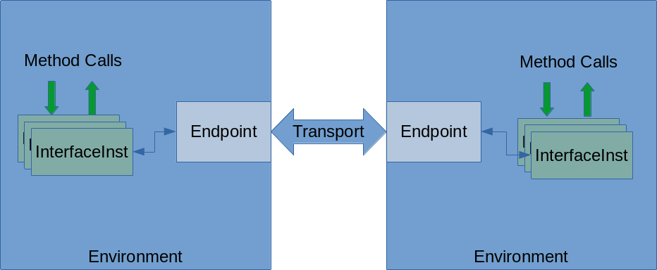
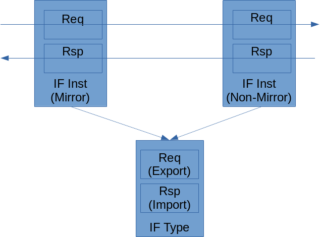

***********************
TbLink RPC Architecture
***********************

Due to the requirements for flexibility and scalability, TbLink RPC
uses a layered architecture. It's reasonable to think of this 
layered architecture as being similar to a network stack. 

Concept Model
=============

Let's start with some key concepts that are used across the document.
There is implementation behind these concepts, but it's useful to 
understand their purpose at a high level before diving into the details.

  

Environments and Endpoints
--------------------------

TbLink RPC exists to allow simulation-centric environments to 
communicate. Each pair of communicating environments has a 
pair of connected endpoints. An environment may communicate
with multiple other environments, but each pair of connected
environments may only be connected by a single pair of
TbLink RPC endpoints.

One result of TbLink RPC being simulation-centric is the 
requirement to  synchronize and control time. For example, when 
one environment is a simulator and the other is a testbench, 
it is critical to ensure that the simulation advances only
once the testbench has responded to all pending simulation
events. If this requirement isn't met, our ability to properly
interact with the design under test (DUT) will be impaired.

TbLink RPC is not a simulator co-simulation framework, with 
support for synchronizing the operation of multiple simulators
each with their own notion of time. Consequently, one 
environment is considered the *Timebase Provider*. The 
*Timebase Provider* environment maintains the current time 
for all environments, and provides support for time-based
callbacks. 

.. note::
  TbLink RPC doesn't enforce the restriction on having only
  a single Timebase Provider. This restriction is simply
  a pragmatic one, given the implementation of capabilities
  of most simultors today.

Methods, Interfaces, and Interface Types
----------------------------------------

TbLink RPC environments communicate via method calls. Method
calls are made with respect to *interface instances*. Each
*interface instance* has an *interface type*, which captures
which methods are available.

An interface type specifies type and usage information about 
methods. Specifically, it captures:

- The return type of the method
- Method parameter names and types
- Whether the method is time-consuming
- Whether the method is an *export* or an *import*.

This last bit -- export vs import -- is of critical importance.
An imported method is called by the environment, while an 
exported method is implemented by the environment and called
by TbLink RPC in response to a call from the peer environment.

Both connected interface instances have the same interface type.
However, one is designated a *mirror* interface. A *mirror* 
interface implements the "mirror" of methods, so an export
method is implemented as an import on a *mirror* interface, and
an import method is implemented as an export.

.. note::
  The terminology of import, export, and mirror comes from the
  vocabulary of Transaction-Level Modeling and IP-XACT IP
  encapsulation.
  
When defining an interface type, whether a method itself is an
import or an export is entirely irrelevant. For example, the 
interface type above could have been defined with *Req* being 
an import and *Rsp* being an export. The practical impact of 
this decision would be that the right-hand interface instance
would need to be specified as a mirror and the left-hand 
interface instance would need to be specified as a non-mirror 
in order to preserve the caller/called relationship.

Methods may be denoted as either time-consuming or non-time-consuming.
This is a critical distinction precisely because TbLink RPC is targeted
at enabling communication with simulation environments. When 
non-time-consuming methods are called, TbLink RPC understands that 
time in the simulation environment must not advance. When time-consuming
methods are called, TbLink RPC understands that it may be necessary for
time in the simulation environment to advance before the method call 
is complete.

Implementation Model
====================

Implementation of TbLink RPC is split into two major components:
user facades and core implementation. As the name suggests, the
user facade is the primary aspect of interest to end users. 
The implementation core is primarily of interest to developers
wishing to extend TbLink RPC to support another front-end 
language and/or simulator integration.

User Facade
-----------
Every language and language methodology used for functional
verification and with simulation models time and events 
in some form. In standard fashion, different languages and
methodologies represent these same concepts in different ways. 
For example, SystemVerilog represents time-consuming methods
as *tasks* and language constructs for modeling events, while 
Python represents the same concept using *async* methods and
classes in the standard library. 

The purpose of language- and methodology-specific facades is 
to adapt TbLink RPC to the appropriate language- and 
methodology-specific constructs. 

The adaptation can go far beyond just adapting TbLink RPC to
threading and event constructs supported by the target
environment. For example, Python provides rich introspection
and annotation capabilities that enable the user to 
capture meta-data for TbLink RPC directly in Python instead
of in a separate side file. 

.. code:: python3

  import tblink_rpc
  import ctypes

  @tblink_rpc.iftype("rv_bfms.initiator")
  class RvInitiatorBfm(object):

      @tblink_rpc.exptask
      async def req(self, data : ctypes.c_uint64):
          pass

      @tblink_rpc.impfunc
      def rsp(self):
          pass

The code snippet above shows interface-type information 
captured as annotations on the Python class that implements
an interface instance. Other environments may have similar
environment- or language-specific mechanisms that provide
enhanced capabilities when TbLink RPC is used with that
environment.

Core Implementation
-------------------

The User Facade layer is characterized by differences. It's goal is 
to provide the best user experience possible based on the target
environment. In contrast, the Core Implementation layer is 
characterized by similarity. In nearly all cases, the 
Core Implementation layer for different languages and environments
have identical APIs, or very nearly identical APIs.

In many cases, this similarity is very important because of 
cross-language reuse of the Core Implementation layer. For example,
when a SystemVerilog is connected via a socket to an executable 
running as a separate process, the SystemVerilog Core Implementation
layer uses the C++ Core Implementation layer to implement 
process management and socket communication.

With that, let's dive into the key objects in the Core Implementation
layer.

- Core
  - Event-driven and non-blocking

- Endpoint (API)
- Endpoint Transport
- Endpoint Launcher

